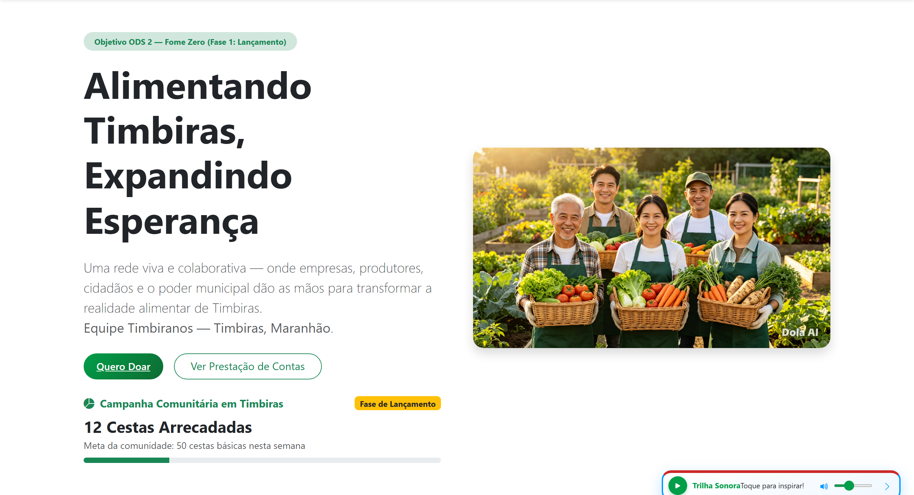
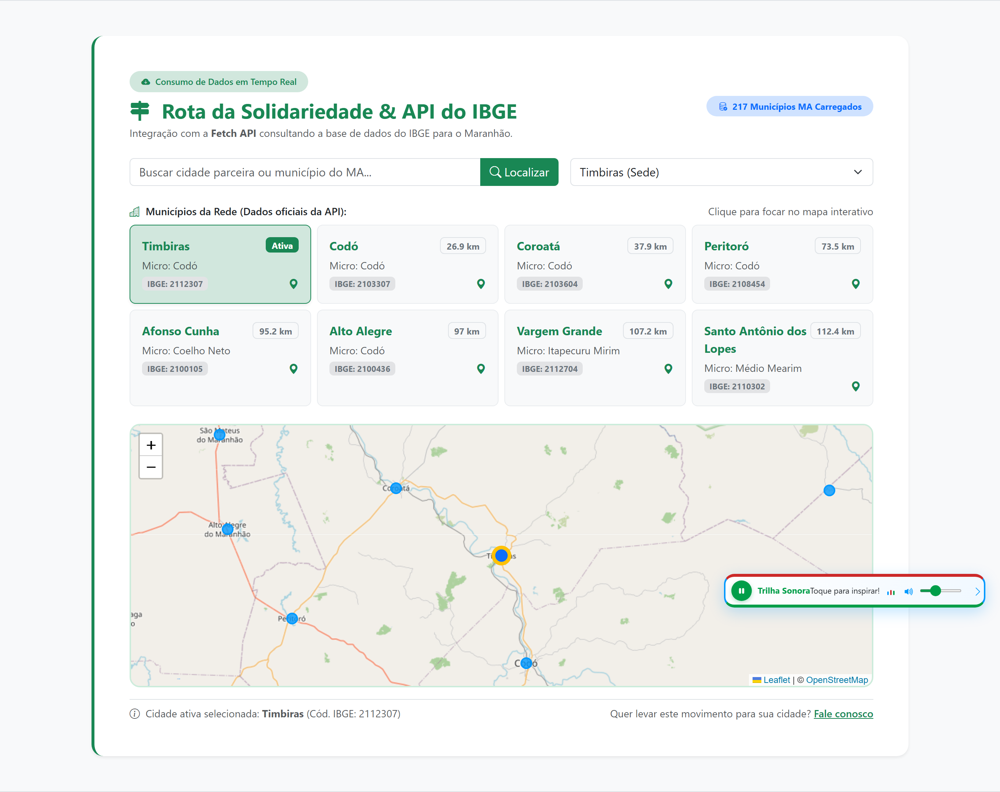
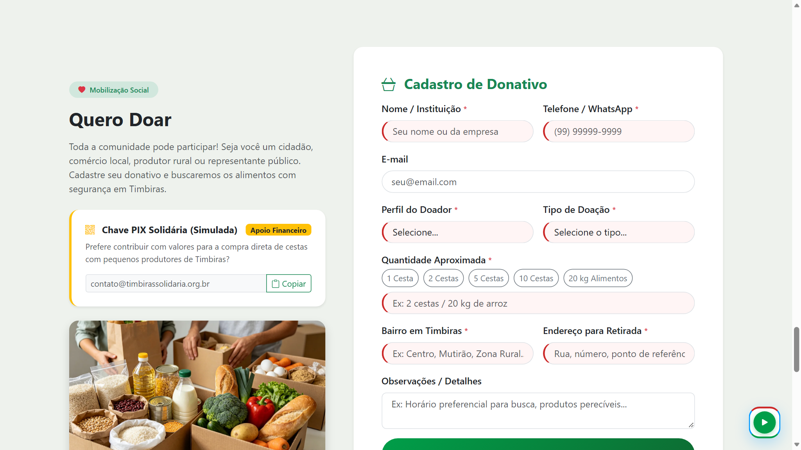
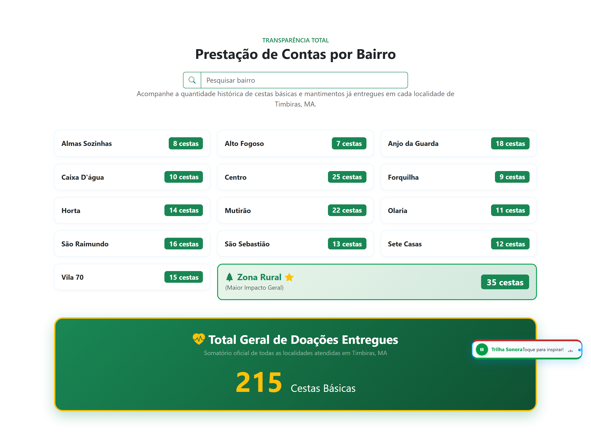
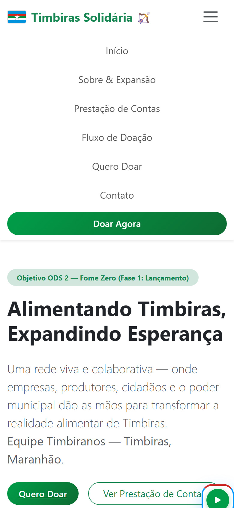

# UNIVERSIDADE ESTADUAL DO MARANHÃO — UEMA
## CENTRO DE CIÊNCIAS TECNOLÓGICAS — CCT
### CURSO SUPERIOR DE TECNOLOGIA EM ANÁLISE E DESENVOLVIMENTO DE SISTEMAS
### DISCIPLINA: DESENVOLVIMENTO WEB | SEMESTRE 2024 / ENTREGA 2026
### POLO UNIVERSITÁRIO DE TIMBIRAS — MARANHÃO

---

# RELATÓRIO TÉCNICO E MEMORIAL DESCRITIVO — ATIVIDADE AVALIATIVA 2 (NOTA 2)

**Título do Projeto:** Timbiras Solidária 🏹  
**Tema e Alinhamento:** ODS 2 — Fome Zero e Agricultura Sustentável (Agenda 2030 / ONU)  
**Município de Referência:** Timbiras — Maranhão (Região dos Cocais / Vale do Itapecuru)  
**Equipe Timbiranos:**
- **Amberson Lindoso**
- **Kelly Sousa**
- **Jhony Fernandes**
- **Weldes Reis**

**Canais e Acessos Oficiais do Projeto:**
- 🌐 **Aplicação no Ar (Produção Vercel):** [https://timbiras-solidaria.vercel.app](https://timbiras-solidaria.vercel.app)
- 💻 **Repositório do Código-Fonte (GitHub):** [https://github.com/ambersonrogers/timbiras-solidaria](https://github.com/ambersonrogers/timbiras-solidaria)
- 📑 **Apresentação em Slides (PDF Oficial ABNT):** [Relatorio_Atividade_2_Slides.pdf](https://timbiras-solidaria.vercel.app/Relatorio_Atividade_2_Slides.pdf)
- 📊 **Apresentação em Slides Editável (PowerPoint PPTX):** [Relatorio_Atividade_2_Slides.pptx](https://timbiras-solidaria.vercel.app/Relatorio_Atividade_2_Slides.pptx)
- 🖥️ **Apresentação em Slides (Visualizador Web):** [https://timbiras-solidaria.vercel.app/slides.html](https://timbiras-solidaria.vercel.app/slides.html)

---

## 1. INTRODUÇÃO: NOSSA TERRA, NOSSA GENTE E A RAZÃO DO PROJETO

### 1.1 Contexto Social e a Realidade de Timbiras (MA)
Timbiras é um município maranhense de gente trabalhadora, acolhedora e cheia de fé, cortado pelas águas históricas do Rio Itapecuru e cercado pela riqueza dos babaçuais da Região dos Cocais. Contudo, assim como em tantas cidades do interior do nosso Estado, a realidade da vulnerabilidade socioeconômica e da insegurança alimentar ainda bate à porta de centenas de famílias.

Nos bairros mais afastados do centro urbano — como Forquilha, Mutirão, Alto Fogoso, Olaria, Anjo da Guarda e Vila Papi — e, de modo ainda mais silencioso, nos povoados da vasta zona rural timbirense, mães e pais de família enfrentam dias de incerteza para colocar comida nutritiva no prato dos seus filhos.

Ao mesmo tempo, nossa cidade possui agricultores familiares dedicados nas hortas e roças comunitárias, além de feirantes e comerciantes solidários que frequentemente possuem produtos excedentes ou disposição para contribuir, mas que não contavam com uma ferramenta simples, transparente e direta para fazer essa doação chegar a quem realmente tem fome.

O projeto **Timbiras Solidária** nasceu dessa inquietação dos estudantes do curso de Análise e Desenvolvimento de Sistemas da UEMA: como futuros profissionais de tecnologia, nós não poderíamos conceber um software abstrato e sem alma. Decidimos usar a disciplina de Desenvolvimento Web para construir uma ponte digital que encurte distâncias e una a nossa própria comunidade.

### 1.2 ODS 2 da ONU: Fome Zero e Agricultura Sustentável
O projeto abraça com firmeza o **Objetivo de Desenvolvimento Sustentável nº 2 da ONU**, conectando tecnologia a metas de vida:
- **Meta 2.1 — Acesso universal a alimentos saudáveis:** Facilitar a canalização de cestas básicas e alimentos não perecíveis para famílias em situação de vulnerabilidade nutricional imediata.
- **Meta 2.3 — Valorização do pequeno produtor:** Promover a circulação e o escoamento de hortaliças, frutas e tubérculos colhidos pelas mãos dos agricultores locais, fortalecendo a economia familiar e garantindo comida fresca.

### 1.3 Público-Alvo que Abraçamos
1. **Famílias em situação de vulnerabilidade:** Destinatárias finais de cada quilo de alimento, mapeadas com dignidade e respeito.
2. **Cidadãos e doadores voluntários:** Moradores de Timbiras ou pessoas da região que desejam doar 1 cesta básica, 1 kg de alimento ou qualquer valor via PIX.
3. **Agricultores familiares e pequenos comerciantes:** Que podem doar excedentes de colheita ou apoiar campanhas de arrecadação.
4. **Lideranças comunitárias e agentes sociais:** Que necessitam de um painel confiável para prestar contas e monitorar as entregas por bairro.

---

## 2. DESENVOLVIMENTO DA APLICAÇÃO: INTERATIVIDADE E MANIPULAÇÃO DO DOM

### 2.1 A Transição da Nota 1 para a Nota 2: Dando Vida ao Projeto
Na primeira etapa da disciplina (Nota 1), nossa equipe construiu a estrutura semântica inicial utilizando HTML5, estilização com CSS3 e componentes de layout do Bootstrap. O site era visualmente agradável e bem organizado, mas comportava-se como um panfleto estático: não reagia às ações de quem navegava, não conversava com a rede e não oferecia feedback instantâneo.

Na Nota 2, assumimos o compromisso de transformar esse protótipo em uma aplicação viva, acolhedora e verdadeiramente interativa. Abandonamos a manipulação manual e dispersa do DOM (`document.getElementById` solto em scripts de rodapé) e adotamos o ecossistema moderno do **React 19**. Dessa forma, cada clique, digitação ou gesto na tela reflete uma mudança consciente no estado da aplicação, atualizando a interface em tempo real de forma suave e elegante.

### 2.2 Manipulação do DOM e Eventos com Propósito Humano

Todo recurso interativo foi desenhado pensando na facilidade de uso do nosso povo:

1. **Envio Consciente e Validação Amigável (`onSubmit` em `Doar.jsx`):**
   - Interceptamos o recarregamento automático da página através de `event.preventDefault()`.
   - Implementamos validação nativa de campos obrigatórios (`form.checkValidity()`). Quando algum dado falta, a interface orienta o usuário de forma clara e paciente, sem jargões indecifráveis.
   - Ao confirmar o donativo, geramos na hora um **Recibo Solidário Digital** com código rastreável único (exemplo: `REC-849201`), acompanhado de mensagem carinhosa de agradecimento e gravação automática no armazenamento do navegador (`localStorage`).

2. **Filtro em Tempo Real nos Bairros (`onChange` em `PrestacaoContas.jsx`):**
   - No interior, as pessoas querem saber como está o seu próprio bairro. Criamos um campo de busca com escutador de evento que normaliza acentos ortográficos (`normalize('NFD')`), permitindo que a busca encontre tanto 'São Sebastião' quanto 'Sao Sebastiao'.
   - Conforme o cidadão digita, a listagem dos 13 bairros e da Zona Rural se adapta instantaneamente, recalculando o total de famílias atendidas sem nenhum atraso.

3. **Chips Rápidos de Doação (`onClick`):**
   - Digitar valores em telas de celular enquanto se caminha pela rua é incômodo. Inserimos botões de toque rápido ('1 Cesta', '2 Cestas', '5 Cestas', '10 Cestas', '20 kg de Alimentos') que preenchem o campo de quantidade com um só toque no dedo.

4. **Cópia da Chave PIX em 1 Clique (Clipboard API):**
   - O botão de PIX utiliza a moderna `navigator.clipboard.writeText(...)`. Quando clicado, a chave institucional é copiada para a área de transferência do usuário e o botão muda temporariamente de cor e texto para *'Chave PIX Copiada com Sucesso!'*, devolvendo a tranquilidade de que o número não foi copiado errado.

5. **Acolhimento com Trilha Sonora Solidária (`PlayerAudio.jsx`):**
   - A fome e a solidariedade tocam o coração humano. Por isso, integramos ao projeto a clássica canção de paz e união *'Imagine'*.
   - Respeitando rigorosamente as boas práticas de usabilidade da web moderna e as políticas dos navegadores, a música não assusta o usuário com reprodução forçada e invasiva. Ela aguarda a primeira rolagem ou toque voluntário do visitante.
   - O player flutuante conta com controle de volume deslizante, botão de silenciamento (`mute`), equalizador com barras pulsantes animadas em CSS e um botão para minimizar o tocador para um canto discreto da tela, sem atrapalhar a leitura.

6. **Menu Móvel Fluido (`Navbar.jsx`):**
   - Criamos o menu sanduíche mobile com controle de estado booleano (`menuAberto`). Ele se expande de forma harmoniosa no smartphone e se fecha sozinho assim que o usuário clica na seção desejada, evitando que o menu fique cobrindo a tela inteira.

---

## 3. CONSUMO DE DADOS: A FORÇA DA API PÚBLICA DO IBGE

### 3.1 A Decisão de Usar Dados Reais e Oficiais
Poderíamos ter criado uma lista fictícia de cidades em um arquivo de texto local, mas a proposta da disciplina nos instigava a dar um passo adiante: aprender a nos comunicar com servidores governamentais reais, tratando respostas assíncronas e estruturando dados como se faz no mercado de trabalho.

Escolhemos conectar a aplicação ao **Serviço de Dados de Localidades do Instituto Brasileiro de Geografia e Estatística (IBGE)**, acessando o endpoint público dos municípios maranhenses:

```http
GET https://servicodados.ibge.gov.br/api/v1/localidades/estados/MA/municipios
```

### 3.2 Como o Código Conecta, Espera e Transforma o JSON
No componente `src/components/ConsumoApi.jsx`, a comunicação foi implementada de maneira segura e profissional:

- **Disparo no Ciclo Certo:** A requisição é executada dentro do hook `useEffect` no momento em que a página carrega.
- **Proteção Contra Travamentos (`AbortController`):** Para evitar que uma troca rápida de tela deixe requisições perdidas na memória do computador ou celular do usuário, anexamos um controlador de cancelamento (`signal: controlador.signal`). Se o componente for desmontado, o processo é encerrado de forma limpa.
- **Conversão e Extração dos Dados:** O fluxo de dados recebido é convertido via `response.json()`. A partir desse payload de 217 cidades do Maranhão, extraímos os dados essenciais:
  - `id`: Código de 7 dígitos oficial do município no IBGE (como `2112307` para Timbiras e `2103307` para Codó);
  - `nome`: Nome oficial da localidade;
  - `microrregiao.nome`: Microrregião geográfica à qual pertence;
  - `microrregiao.mesorregiao.nome`: Grande mesorregião do Estado.

```javascript
useEffect(() => {
  const controlador = new AbortController();
  setCarregando(true);

  fetch('https://servicodados.ibge.gov.br/api/v1/localidades/estados/MA/municipios', {
    signal: controlador.signal
  })
    .then(resposta => {
      if (!resposta.ok) {
        throw new Error('Não foi possível carregar os dados do IBGE no momento.');
      }
      return resposta.json();
    })
    .then(dadosRecebidos => {
      setMunicipiosIbge(dadosRecebidos);
      setErro(null);
    })
    .catch(erroCapturado => {
      if (erroCapturado.name !== 'AbortError') {
        setErro('Conexão instável. Não conseguimos consultar o IBGE agora.');
      }
    })
    .finally(() => {
      setCarregando(false);
    });

  return () => controlador.abort();
}, []);
```

### 3.3 Acolhendo as Dificuldades da Conexão: Loading, Error e Sucesso
No Maranhão, o acesso à internet via 3G ou 4G oscila com frequência. Uma aplicação web de qualidade precisa estar preparada para isso:
1. **Durante a Espera (Loading):** Exibimos uma animação leve com mensagem honesta: *'Consultando API pública do IBGE (Serviço de Localidades)...'*.
2. **Se a Rede Falhar (Error):** A tela não congela nem fica em branco. Exibimos um painel explicativo com o botão *'Recarregar API'*, que permite ao usuário tentar novamente sem precisar atualizar todo o site.
3. **Quando os Dados Chegam (Sucesso):** Renderizamos a vitrine da **'Rota da Solidariedade'**, destacando os polos regionais (Timbiras, Codó, Coroatá, Peritoró, Caxias e Alto Alegre) com seus códigos e microrregiões oficiais, além de um seletor dinâmico com todas as 217 cidades do Maranhão.

### 3.4 Conectando o IBGE ao Mapa Interativo dos Cocais
Cruzamos os dados da API governamental com as coordenadas geográficas na biblioteca de mapas **Leaflet**. Quando o visitante clica no card de qualquer cidade parceira, o mapa faz uma viagem suave de câmera (`mapa.flyTo`), exibindo um marcador customizado com o nome oficial, a distância até o polo de Timbiras e a situação da rota de transporte de alimentos.

---

## 4. ORGANIZAÇÃO COM FRAMEWORK: REACT 19 E ARQUITETURA SPA

### 4.1 Decomposição em Componentes com Propósito
Para que o desenvolvimento em equipe fluísse com harmonia, organizamos o código em componentes modulares na pasta `src/components/`, onde cada arquivo possui uma responsabilidade clara e bem definida:

```text
timbiras-solidaria/
├── public/
│   ├── img/                  → Imagens reais da agricultura familiar e prints comprobatórios
│   ├── audio/                → Trilha sonora de paz e acolhimento (Imagine)
│   ├── slides.html           → Visualizador web interativo da apresentação
│   ├── Relatorio_Atividade_2_Slides.pdf → Slides oficiais da entrega em formato PDF
│   └── Relatorio_Atividade_2_Slides.pptx → Slides oficiais editáveis no Microsoft PowerPoint
├── src/
│   ├── components/
│   │   ├── SplashScreen.jsx     → Tela de boas-vindas com animação e identidade local
│   │   ├── PlayerAudio.jsx      → Tocador com controle de volume e equalizador dinâmico
│   │   ├── Navbar.jsx           → Barra de navegação com menu móvel retrátil
│   │   ├── Hero.jsx             → Banner principal com contador de cestas e meta comunitária
│   │   ├── ConsumoApi.jsx       → Integração assíncrona com IBGE e mapa geográfico Leaflet
│   │   ├── SobreCompleto.jsx    → Memorial histórico de Timbiras e o impacto da solidariedade
│   │   ├── ComoFunciona.jsx     → Guia de doação explicado em 4 passos ilustrados
│   │   ├── Fluxo.jsx            → Infográfico da jornada do alimento da roça à mesa
│   │   ├── PrestacaoContas.jsx  → Painel de transparência por bairros e zona rural
│   │   ├── Doar.jsx             → Formulário com chips rápidos, PIX e recibo dinâmico
│   │   ├── Contato.jsx          → Ouvidoria e canais de comunicação com a comunidade
│   │   └── Footer.jsx           → Rodapé institucional, créditos acadêmicos e links
│   ├── data/
│   │   └── siteData.js          → Base de dados geográficos e dados históricos locais
│   ├── App.jsx                  → Orquestrador do estado global de doações e navegação
│   ├── main.jsx                 → Inicializador da raiz do React no DOM
│   └── index.css                → Folha de estilo com identidade visual maranhense
├── package.json                 → Dependências e scripts de automação
└── vercel.json                  → Regras de roteamento para nuvem da Vercel
```

### 4.2 Gerenciamento do Estado da Aplicação
Utilizamos os hooks fundamentais do React de maneira consciente e equilibrada:
- **`useState`:** Gerencia as informações dinâmicas do dia a dia da aplicação — o total acumulado de cestas doadas, o texto digitado no filtro de bairros, os dados retornados pelo IBGE, o estado de abertura do menu no celular e o volume do áudio.
- **`useEffect`:** Coordena a conversa com o mundo exterior — realiza a chamada à API do IBGE logo no início, escuta cliques do visitante para ativar suavemente a música e gerencia a saída graciosa da Splash Screen.
- **`useRef`:** Mantém o controle direto da tag HTML `<audio>` sem obrigar a tela inteira a redesenhar a cada alteração de segundo da música.
- **`useMemo`:** Otimiza o processamento matemático e o cruzamento entre as cidades da lista do IBGE e os marcadores do mapa geográfico.
- **`localStorage`:** Salva o total de donativos no próprio navegador do usuário, garantindo que mesmo ao fechar a janela ou reiniciar o celular, os donativos continuem lá registrados.

### 4.3 Experiência de Página Única (Single Page Application - SPA)
Antigamente, para ir de uma seção à outra, o usuário precisava esperar o navegador descarregar toda a página e montar outra tela em branco, o que gerava lentidão e interrompia qualquer áudio em reprodução. Como uma **SPA moderna**, a navegação no *Timbiras Solidária* é feita por deslizamento suave (`smooth scroll`). A música continua tocando sem interrupções e as informações preenchidas nos formulários permanecem intactas.

---

## 5. TESTES, DESAFIOS SUPERADOS E PUBLICAÇÃO NO AR

### 5.1 O Que Deu Errado na Prática e Como a Equipe Superou
Desenvolver software de verdade significa encontrar obstáculos e trabalhar em equipe para superá-los. Durante as semanas de desenvolvimento, enfrentamos desafios técnicos relevantes:

1. **O Desafio do Menu no Celular:**
   *Problema:* Na primeira versão em telas pequenas, os links do cabeçalho quebravam em várias linhas, empurrando a barra de metas para fora da tela e dificultando o toque com o polegar.
   *Solução:* Construímos um menu retrátil acionado por um botão hambúrguer estilizado, controlado pelo estado `menuAberto` no React. Quando qualquer link é tocado, o menu se fecha sozinho suavemente.

2. **A Informação da API que Precisava Ficar Visível:**
   *Problema:* Inicialmente, fazíamos a requisição ao IBGE apenas para validar os nomes das cidades no código interno. Porém, para atender aos critérios do professor, os dados do servidor governamental precisavam ser úteis e visíveis para o cidadão.
   *Solução:* Criamos a seção visual **'Rota da Solidariedade'**, que exibe cards com o Código Oficial do IBGE (7 dígitos), a Microrregião e a distância rodoviária, integrando esses dados ao mapa interativo.

3. **Avisos de Renderização em Cascata no Linter:**
   *Problema:* O linter apontou que disparar atualizações de estado síncronas logo na montagem de um componente poderia causar ciclos desnecessários de redesenho na tela.
   *Solução:* Reorganizamos o fluxo de inicialização e o tratamento de efeitos colaterais no `useEffect`, eliminando todos os avisos do linter.

### 5.2 Bateria de Testes Executados
- **Compilação de Produção (`npm run build`):** O projeto foi compilado utilizando o Vite, gerando os arquivos de distribuição otimizados e minificados em apenas 1,05 segundos.
- **Análise Estática de Código (`npm run lint`):** Executamos o `oxlint` sobre todos os arquivos `.jsx` e `.js`, obtendo **0 erros** e **0 avisos**.
- **Testes de Resiliência e Conectividade:** Desconectamos propositalmente o cabo de rede durante a chamada da API para validar a tela de erro amigável e o botão de recarregar.
- **Testes Manuais em Dispositivos Móveis:** Testamos o site em smartphones reais (Android e iOS) dos membros da equipe, avaliando conforto do toque, legibilidade dos textos e funcionamento do PIX com um só dedo.

### 5.3 Publicação na Nuvem (Vercel) e Repositório Público (GitHub)
Para que a comunidade acadêmica, a tutoria e a população em geral possam acessar o sistema livremente, realizamos a publicação contínua:
- **Repositório GitHub:** Contém o histórico de versões e código-fonte completo:  
  👉 [https://github.com/ambersonrogers/timbiras-solidaria](https://github.com/ambersonrogers/timbiras-solidaria)
- **Deploy em Produção na Vercel:** Hospedado em infraestrutura de nuvem com certificado de segurança SSL/HTTPS e arquivo `vercel.json` para tratamento das rotas SPA:  
  👉 [https://timbiras-solidaria.vercel.app](https://timbiras-solidaria.vercel.app)

---

## 6. EVIDÊNCIAS VISUAIS DO PROJETO EM FUNCIONAMENTO

Em cumprimento rigoroso aos critérios de avaliação da Nota 2, apresentamos a seguir os registros visuais capturados diretamente da aplicação em ambiente de produção:

### Figura 1 — Tela Inicial e Painel de Metas Comunitárias (Desktop)

*Fonte: Captura direta em produção realizada pela Equipe Timbiranos (2026).*  
**Descrição Detalhada:** A interface inicial acolhe o visitante com a identidade visual maranhense, badge oficial do ODS 2 da ONU, menu de navegação completo e o painel de impacto com o contador reativo de cestas arrecadadas e a barra de progresso da meta comunitária.

---

### Figura 2 — Consumo em Tempo Real da API do IBGE e Mapa Interativo

*Fonte: Captura direta em produção realizada pela Equipe Timbiranos (2026).*  
**Descrição Detalhada:** Seção 'Rota da Solidariedade' demonstrando a integração com o endpoint público do IBGE. Os cards exibem os Códigos Oficiais de 7 dígitos (Timbiras: `2112307`, Codó: `2103307`, etc.) e microrregiões, sincronizados com a animação de voo e marcadores do mapa Leaflet.

---

### Figura 3 — Formulário de Doação com Chips Rápidos e Chave PIX

*Fonte: Captura direta em produção realizada pela Equipe Timbiranos (2026).*  
**Descrição Detalhada:** Recursos práticos de interatividade: seleção com 1 clique de quantidades predefinidas ('1 Cesta', '2 Cestas', etc.), botão de cópia de chave PIX com feedback tátil na tela, validação de campos obrigatórios e geração automática do Recibo Solidário Digital.

---

### Figura 4 — Painel de Transparência e Prestação de Contas por Bairro

*Fonte: Captura direta em produção realizada pela Equipe Timbiranos (2026).*  
**Descrição Detalhada:** Listagem dos 13 bairros e da Zona Rural de Timbiras com filtro de busca em tempo real (`onChange`), demonstrando total transparência na distribuição dos donativos e contabilizando mais de 215 cestas já entregues.

---

### Figura 5 — Responsividade e Acessibilidade em Smartphones (Mobile)
<div align="center">
  
</div>

*Fonte: Captura direta em smartphone (390x844px) realizada pela Equipe Timbiranos (2026).*  
**Descrição Detalhada:** Demonstração da adaptação da interface para telas de smartphone, com menu hambúrguer móvel expansível, tipografia legível, botões de toque com tamanho adequado para o polegar e reorganização fluida de todos os cards em coluna única.

---

## 7. CONCLUSÃO E LIÇÕES APRENDIDAS

Concluir a segunda atividade avaliativa da disciplina de Desenvolvimento Web representou um marco de grande amadurecimento para nós, estudantes de Análise e Desenvolvimento de Sistemas da UEMA em Timbiras. 

Ao longo deste percurso, compreendemos na prática que:
1. **O código só tem valor quando toca a vida das pessoas:** O React, o Bootstrap, o Vite e as APIs públicas ganham um significado nobre quando colocados a serviço de quem mais precisa de acolhimento e alimentação.
2. **A arquitetura declarativa do React traz segurança e robustez:** O gerenciamento cuidadoso de estados através de hooks nos permitiu criar uma experiência de usuário contínua, estável e livre das antigas falhas de recarregamento brusco de tela.
3. **Trabalhar com dados governamentais é fundamental para o desenvolvedor moderno:** A experiência de consumir o serviço oficial de municípios do IBGE via Fetch API, tratando cenários de lentidão e falhas de conexão, nos preparou para os desafios reais da engenharia de software na web.

A **Equipe Timbiranos** entrega este trabalho com alegria e profundo respeito à nossa universidade e à nossa cidade. O projeto está no ar, funcionando perfeitamente em computadores e celulares, com repositório público atualizado, apresentação de slides gerada em PDF e PowerPoint (.pptx) editável e memorial descritivo completo, prontos para a apresentação presencial no polo de Timbiras durante a **Nota 3**.

---

## REFERÊNCIAS BIBLIOGRÁFICAS (NORMAS ABNT)

- **BOOTSTRAP.** *Bootstrap: Powerful, extensible, and feature-packed frontend toolkit*. Versão 5.3. Bootstrap Team, 2026. Disponível em: <https://getbootstrap.com/>. Acesso em: 17 set. 2026.
- **BRASIL.** Instituto Brasileiro de Geografia e Estatística (IBGE). *API de Serviços de Dados: Localidades — Municípios do Maranhão*. Rio de Janeiro: IBGE, 2026. Disponível em: <https://servicodados.ibge.gov.br/api/docs/localidades>. Acesso em: 17 set. 2026.
- **MDN WEB DOCS.** *Fetch API: Usando Fetch e consumo assíncrono em JavaScript*. Mozilla Developer Network, 2026. Disponível em: <https://developer.mozilla.org/pt-BR/docs/Web/API/Fetch_API/Using_Fetch>. Acesso em: 17 set. 2026.
- **MDN WEB DOCS.** *Manipulação do DOM e escuta de eventos com addEventListener*. Mozilla Developer Network, 2026. Disponível em: <https://developer.mozilla.org/pt-BR/docs/Web/API/EventTarget/addEventListener>. Acesso em: 17 set. 2026.
- **ORGANIZAÇÃO DAS NAÇÕES UNIDAS (ONU).** *Objetivo de Desenvolvimento Sustentável 2: Fome Zero e Agricultura Sustentável*. Brasília: Nações Unidas Brasil, 2015. Disponível em: <https://brasil.un.org/pt-br/sdgs/2>. Acesso em: 17 set. 2026.
- **REACT.** *React — A JavaScript library for building user interfaces*. Versão 19. Meta Open Source, 2026. Disponível em: <https://react.dev/>. Acesso em: 17 set. 2026.
- **VITE.** *Next Generation Frontend Tooling*. Evan You & Equipe de Contribuidores Vite, 2026. Disponível em: <https://vitejs.dev/>. Acesso em: 17 set. 2026.
